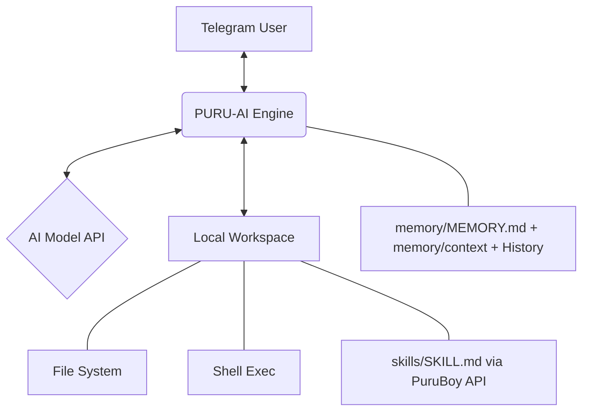

# 🤖 PURU-AI

[](https://golang.org/)
[](LICENSE)
[](https://github.com/purujawa06-bot/PURU-AI/pkgs/container/puru-ai)

**PURU-AI** is a lightweight, high-performance AI assistant for Telegram, engineered in Go. It seamlessly bridges OpenAI-compatible intelligence with a robust local execution engine, providing a powerful, self-hosted workspace operator.

---

## ✨ Key Highlights

- ⚡ **Minimalist & Fast** — Single Go binary with a tiny footprint. No heavy runtimes.
- 🛠️ **Local Tool Intelligence** — Native file operations, shell execution, and web navigation.
- 🧠 **Smart Context Management** — Long-term memory via `memory/MEMORY.md` and automated history summarization into `memory/context/`.
- 🧩 **Skills** — Picoclaw-style `skills/*/SKILL.md` catalog with PuruBoy find/install API.
- 🔄 **Async Process Control** — Manage long-running background tasks with real-time polling and termination.
- 🔒 **Security First** — Granular workspace restrictions and memory-capped execution.
- 🐳 **Cloud Ready** — Pre-configured for Docker and GitHub Container Registry (GHCR).

---

## 🏗️ Architecture



### Workspace layout (picoclaw-style)

```text
<workspace>/
  AGENTS.md                  # agent identity (AGENT.md accepted as legacy alias)
  SOUL.md                    # personality and values
  USER.md                    # user profile
  memory/MEMORY.md           # long-term memory, written by the agent
  memory/context/*.md        # conversation summaries, system-managed (newest 20)
  skills/<skill>/SKILL.md    # installed skills
```

Find skills: `curl -X GET "https://puruboy-api.vercel.app/api/agent-tools/find-skills?query=web+design&limit=5"`
Install: `curl -X GET "https://puruboy-api.vercel.app/api/agent-tools/install-skills?source=vercel-labs/agent-skills&skill=web-design-guidelines"` → save to `skills/<skill>/SKILL.md`.

---

## 🚀 Getting Started

### Install via npm (easiest, no web server)

```bash
npm i -g @rikipurpur/puru-ai
puru setup        # wizard → writes ~/.puru/config.json
puru gateway      # run the Telegram bot (long-polling, no /health by default)
puru gateway --health --port 8080   # opt-in health check for Docker/VPS
puru chat "halo"  # local debug without Telegram
```

> The npm package downloads the prebuilt `puru` binary from GitHub Releases
> on postinstall (linux/darwin/windows × amd64/arm64, plus linux/arm untuk
> Termux Android 32-bit). Binaries are built
> automatically by the manual **Release** workflow (`verify → tag →
> build-binaries + docker → GitHub Release → npm publish`).

### Termux (Android)

```bash
pkg install nodejs
npm i -g @rikipurpur/puru-ai
puru setup
puru gateway
```

### Deploy with Docker (Recommended)

```bash
docker run -d \
  --name puru-ai \
  -e TELEGRAM_BOT_TOKEN="your_token_here" \
  -v puru-data:/root/.puru \
  ghcr.io/purujawa06-bot/puru-ai:latest
```

### Local Build

1. **Clone & Build:**
   ```bash
   git clone https://github.com/purujawa06-bot/PURU-AI.git
   cd PURU-AI
   go build -o puru-ai .
   ```

2. **Configure:**
   ```bash
   cp example.config.json config.json
   # Edit config.json with your API keys and workspace path
   ```

3. **Run:**
   ```bash
   ./puru-ai --config config.json
   ```

---

## 🛠️ Capability Suite

| Category | Tool | Description |
| :--- | :--- | :--- |
| **File System** | `read`, `write`, `edit`, `ls` | Precise file manipulation with fuzzy matching support. |
| **Execution** | `exec` | Run blocking or background commands with RAM limits. |
| **Web** | `search`, `fetch` | Real-time web search and content extraction. |
| **Telegram** | `sendfile`, `getuser` | Direct interaction with Telegram's API for file sharing. |
| **Runtime** | `get_env` | System telemetry (OS, Arch, Go version, Memory). |

---

## ⚙️ Configuration

| Key | Type | Description |
| :--- | :--- | :--- |
| `telegram_bot_token` | `string` | Your Telegram Bot API token. |
| `workspace` | `string` | The root directory for all file operations. |
| `restrict_workspace` | `bool` | Prevents the AI from accessing files outside the workspace. |
| `exec_memory_mb` | `int` | Hard RAM limit for executed shell processes. |

---

## 📱 User Interface

In Telegram, use the following commands:
- `/help` — List available features.
- `/clear` — Reset conversation context.
- `/token` — Monitor token usage and costs.
- `/stop` — Force-kill the active background session.

---

## 🧪 Development

Maintain the codebase with these commands:

```bash
# Run the test suite
go test ./...

# Perform static analysis
go vet ./...

# Format the source code
gofmt -s -w .
```

---

## 📜 License

Distributed under the **MIT License**. See `LICENSE` for details.

---
<p align="center">Made with ❤️ by <b>Ricky</b> & <b>Cia</b></p>